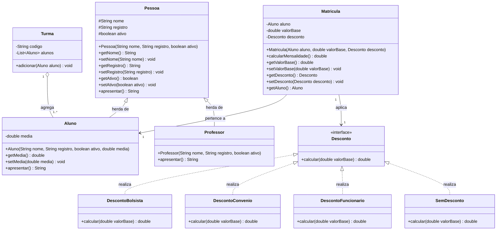
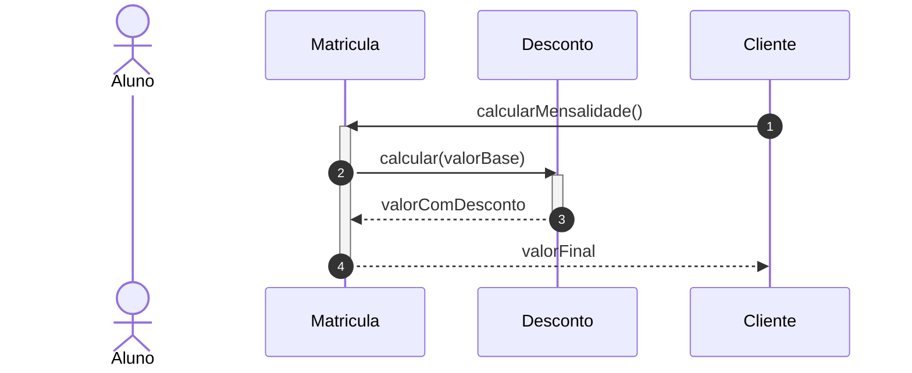

# SIGA —  UML Aplicada a Padrões de Projeto
**Técnicas de Programação II (TP2) · Aula 4** — CST em Desenvolvimento de Software Multiplataforma · Fatec de Porto Ferreira

## 1. Diagrama de Classes do Domínio

## 2. Diagrama de Sequência: Cálculo da Mensalidade

