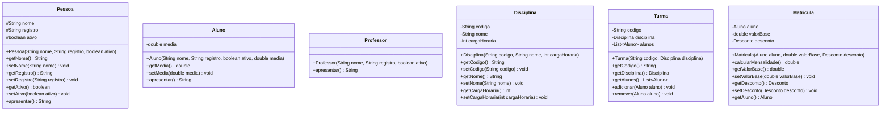

```mermaid
classDiagram
    direction TB

    %% Entidades Principais
    class Pessoa {
        #String nome
        #String registro
        #boolean ativo
        +Pessoa(String nome, String registro, boolean ativo)
        +getNome() String
        +setNome(String nome) void
        +getRegistro() String
        +setRegistro(String registro) void
        +getAtivo() boolean
        +setAtivo(boolean ativo) void
        +apresentar() String
    }

    class Aluno {
        -double media
        +Aluno(String nome, String registro, boolean ativo, double media)
        +getMedia() double
        +setMedia(double media) void
        +apresentar() String
    }

    class Professor {
        +Professor(String nome, String registro, boolean ativo)
        +apresentar() String
    }

    class Disciplina {
        -String codigo
        -String nome
        -int cargaHoraria
        +Disciplina(String codigo, String nome, int cargaHoraria)
        +getCodigo() String
        +setCodigo(String codigo) void
        +getNome() String
        +setNome(String nome) void
        +getCargaHoraria() int
        +setCargaHoraria(int cargaHoraria) void
    }

    class Turma {
        -String codigo
        -Disciplina disciplina
        -List~Aluno~ alunos
        +Turma(String codigo, Disciplina disciplina)
        +getCodigo() String
        +getDisciplina() Disciplina
        +getAlunos() List~Aluno~
        +adicionar(Aluno aluno) void
        +remover(Aluno aluno) void
    }

    class Matricula {
        -Aluno aluno
        -double valorBase
        -Desconto desconto
        +Matricula(Aluno aluno, double valorBase, Desconto desconto)
        +calcularMensalidade() double
        +getValorBase() double
        +setValorBase(double valorBase) void
        +getDesconto() Desconto
        +setDesconto(Desconto desconto) void
        +getAluno() Aluno
    }
```